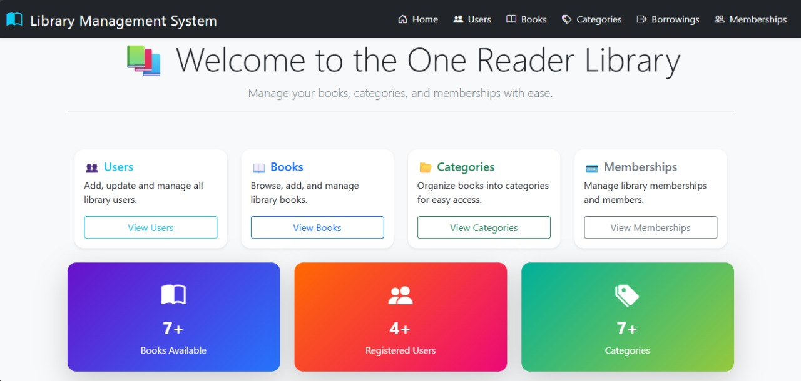

# 📖 Library Management System (The One Reader Library)

## 📌 Overview  
The **Library Management System** is a web-based application developed with **ASP.NET Core MVC**.  
It provides an efficient way to manage books, categories, users, and borrowing operations in a digital library environment.  
The project is continuously evolving with multiple versions to include more features and better usability.  

---

## 🏗 Versions  

### ✅ Version 1.0  
- Admin panel only.  
- Basic CRUD operations for **Books** and **Categories**.  
- Image upload support for book covers.  
- Reusable Delete Modal for safe record deletion.  
- Database integration with **SQL Server** and **Entity Framework Core**.  
- **AJAX & jQuery** for real-time book operations and borrowing system.  
- **Dependency Injection (DI)** for cleaner architecture and service management.  
- **Authentication & Validation** to check if a user exists before allowing borrow requests.  

### 🔜 Version 2.0 (in progress)  
- Separate roles for **Admin** and **User**.  
- Borrowing system enhancements with history tracking.  
➕ Online Borrowing: Allow users to request and borrow books directly through the system.
- User dashboard to view available books and their borrow status.  
- Advanced search and filtering.  
- Additional UI enhancements for better user experience.  
🔧 Other planned modifications and improvements.

---

## ✨ Features  
- 📚 **Books Management**: Add, edit, delete, and search books.  
- 🏷 **Categories Management**: Organize books by categories.  
- 👤 **Users Management**: Manage library members and roles.  
- 🔄 **Borrowing System**: Track borrowed and returned books.  
- 🖼 **Image Upload**: Upload and display book covers using `IFormFile`.  
- 🔍 **Search & Filter**: Quick access to books by title, author, or category.  
- ⚡ **AJAX & jQuery**: Dynamic operations without page reload.  
- 🗑 **Reusable Delete Modal**: Centralized delete confirmation system.  
- 🛡 **Authentication**: Ensure only valid users can borrow books.  

---

## 🛠 Tech Stack  
- **Frontend**: HTML5, CSS3, Bootstrap 5, JavaScript, jQuery, AJAX  
- **Backend**: ASP.NET Core MVC (.NET 8)  
- **Database**: Microsoft SQL Server  
- **ORM**: Entity Framework Core with LINQ
- **Version Control**: Git & GitHub  

---

## 📸 Screenshots  

### 📊 Dashboard  

  

---

