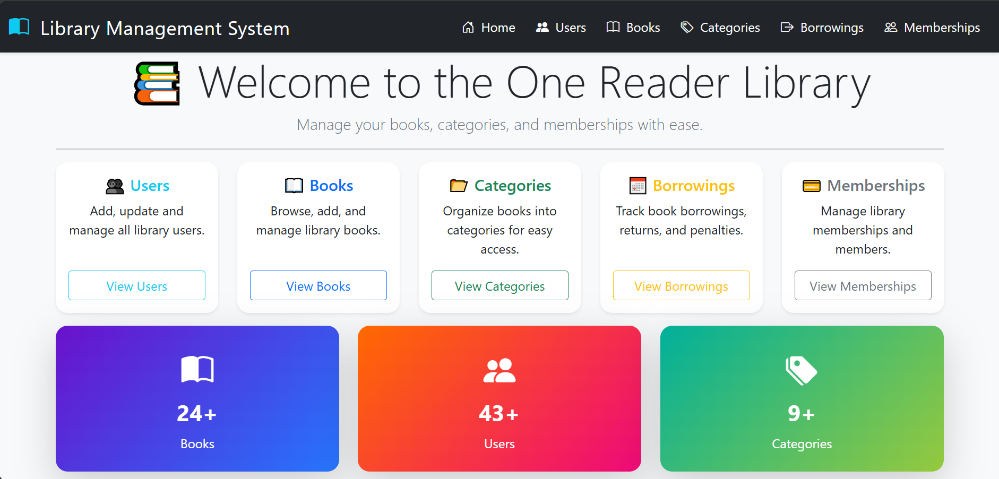
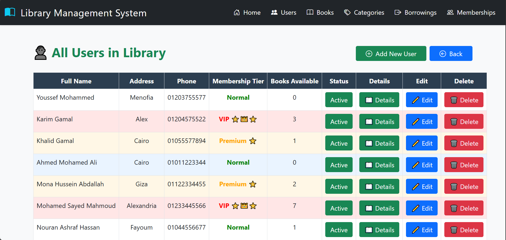
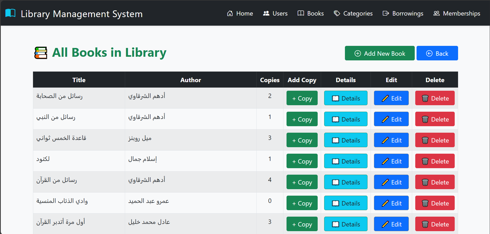
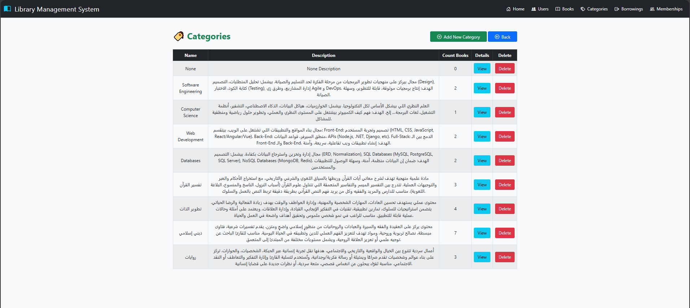
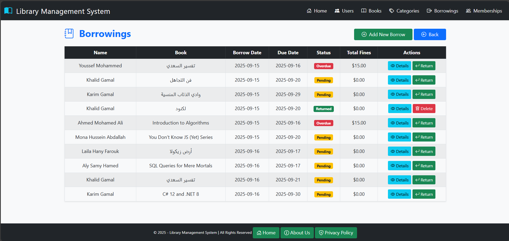
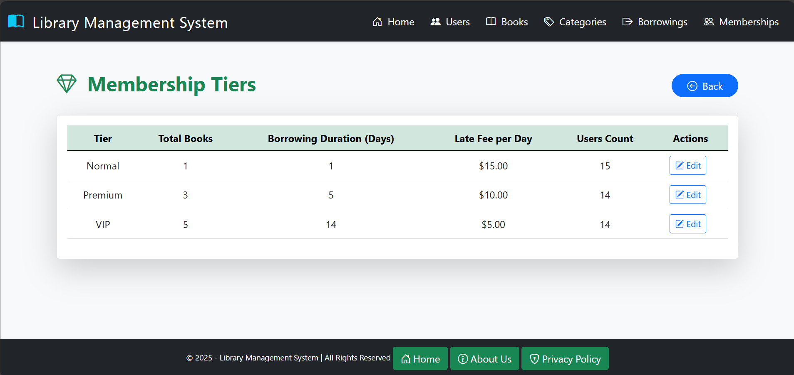

# 📖 Library Management System (The One Reader Library)

## 📌 Overview  
The **Library Management System** is a web-based application developed with **ASP.NET Core MVC**.  
It provides an efficient way to manage **books, users, and borrowing operations** in a digital library environment.  
The project is continuously evolving with multiple versions to include more features and better usability.  

---

## 🏗 Versions  

### ✅ Version 1.0  
- Admin panel for system management.  
- Full **CRUD operations** for **Books** and **Users**.  
- Partial CRUD for other entities (e.g., Categories, Borrowing).  
- Image upload support for book covers.  
- Reusable Delete Modal for safe record deletion.  
- Database integration with **SQL Server** and **Entity Framework Core**.  
- **Unit of Work & Repository Pattern** for clean data access and separation of concerns.  
- **Dependency Injection (DI)** for better architecture and service management.  
- **Authentication & Validation** to check if a user exists before allowing borrow requests.  

### 🔜 Version 2.0 (in progress)  
- Under development... 🚀  

---

## ✨ Features  
- 📚 **Books Management**: Add, Read, edit, delete books.  
- 👤 **Users Management**: Add, Read, edit, delete members.  
- 🏷 **Categories (basic)**: Organize books by categories.  
- 🔄 **Borrowing (basic)**: Track borrowed and returned books.  
- 🖼 **Image Upload**: Upload and display book covers using `IFormFile`.  
- ⚡ **AJAX & jQuery**: Dynamic operations without page reload.  
- 🗑 **Reusable Delete Modal**: Centralized delete confirmation system.  
- 🛡 **Authentication**: Ensure only valid users can borrow books.  

---

## 🛠 Tech Stack  
- **Frontend**: HTML5, CSS3, Bootstrap 5, JavaScript, jQuery, AJAX  
- **Backend**: ASP.NET Core MVC (.NET 8)  
- **Database**: Microsoft SQL Server  
- **ORM**: Entity Framework Core with LINQ  
- **Patterns**: Unit of Work & Repository  
- **Version Control**: Git & GitHub  

---

## 📸 Screenshots  

### 📊 Dashboard  
  

### 👤 Users Management  
  

### 📚 Books Management  
  

### 🏷 Categories Management  
  

### 🔄 Borrowing System  
  

### 💳 Membership Tiers  
  
